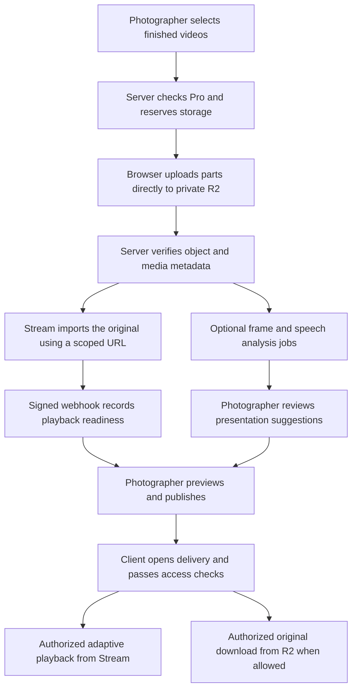

# Video Delivery: full build plan

Date: 10 October 2026. Status: implementation and local validation complete; production qualification remains gated. See [setup and release checks](video-delivery-operations.md) for the implementation record and outstanding provider/device/load checks.

This plan is grounded in the current Veylo codebase and Cloudflare's documentation checked on the date above. It covers the complete feature, its operating costs, the pages that need updating, and the checks required before release. Creating this document does not enable video uploads or change the live product.

## 1. What we are building

A photographer or studio on Pro can upload finished videos, arrange them in a branded delivery, and send one private link. The client opens that link on their phone, watches a video, chooses another if there is more than one, and downloads the original when the photographer permits it.

For example, a wedding delivery might contain the wedding film, a short highlight, and a vertical edit. A campaign delivery might contain the main advert and several finished social edits. The photographer should not have to create a separate link for every export.

Video Delivery becomes a fourth delivery type beside Showcase, GridBoard and PhotoSwap. The eight photo Showcase formats remain eight. Existing photo delivery, Image Library collaboration and editor handoff continue through their existing paths.

### Confirmed requirements

| Requirement | Implementation commitment |
| --- | --- |
| Pro only | Creation, uploads, publishing and continuing video hosting require a valid Pro entitlement, checked on the server. Clients do not need Pro. |
| Existing subscription price | Video Delivery is a Pro feature within the existing ₦40,000/month plan. Free remains ₦0; no separate video price is introduced. |
| Video-only deliveries | A delivery contains finished videos. Poster images and studio branding are presentation assets, not an additional photo gallery. |
| Maximum 5 GB per video | Enforce the limit before upload and against the actual uploaded object. Do not use the previously discussed 20 GB limit. |
| Shared 100 GB | Video originals use the photographer's existing storage allowance alongside Image Library files and returned edits. |
| R2 plus Stream | Keep original exports in private R2 storage; use Stream for adaptive playback. |
| Useful AI | Analyze actual footage with bounded visual sampling; optionally include speech. Suggest presentation that the photographer can review. |
| Paid AI usage is acceptable | Use the free daily allocation where available, but do not reduce analysis quality simply to remain within 10,000 Neurons. |
| Update the whole product | Include creation, delivery, account usage, pricing, marketing, policies, admin operations and Veylo Assistant. |

Veylo remains a delivery service for finished work. This feature does not introduce a video editor, raw-footage archive, live streaming, or mixed photo-and-video projects.

## 2. Recommended initial limits

These are proposed launch defaults for approval, not limits the user has already confirmed. Store them in validated server configuration and publish the relevant values to the client and Assistant from that same source.

| Setting | Recommended default | Reason |
| --- | --- | --- |
| Videos per delivery | 1–10 | Covers a main film and related exports without an unwieldy client playlist. |
| Maximum file size | 5,000,000,000 bytes, displayed as 5 GB | A precise interpretation of the requested limit. |
| Maximum duration per video | 3 hours | Allows longer event films while bounding processing and analysis. |
| Minimum size or duration | No additional commercial minimum | Require a nonempty, decodable video that the playback provider accepts. |
| Initial file containers | MP4, MOV and WebM | Inspect the real media; a filename extension is insufficient. |
| Recommended export | MP4 with H.264 video and AAC audio | A straightforward compatibility recommendation. |
| Shared original storage | Existing 100 GB account allowance | No second 100 GB allowance for videos. |
| Stored video duration | 1,000 minutes per account at any time | Controls a cost that file size alone does not constrain. |
| Monthly playback allowance | 5,000 delivered minutes per account | Controls aggregate viewing cost across deliveries and previews. |
| Simultaneous file transfers | 2 per photographer, with a 1-file mode | Keeps mobile connections usable while permitting desktop progress. |
| Platform file-transfer admission | 100 active files initially | A configurable starting point, subject to staging measurements. |
| Stream processing admission | 100 queued/encoding videos across the Cloudflare account | Leaves headroom below the documented default of 120. |
| Active playback-session admission | 100 per photographer | A proposed application admission limit, not a provider viewer limit. |
| Initial platform viewing test | 1,000 simultaneous sessions | A test target, not a promise of verified production capacity. |
| Expired-Pro recovery period | 30 days | Private recovery time before scheduled permanent deletion. |

All applicable limits apply together. Ten three-hour videos would exceed a 1,000-minute stored-duration allowance even if their file sizes fit. Limits are account-wide where stated, not multiplied by the number of deliveries.

The existing account quota is implemented as `100 * 1024 ** 3` bytes. Preserve that existing entitlement rather than silently shrinking it to decimal 100 GB. Keep quota calculations in integer bytes; explain the proposed decimal 5 GB file boundary in upload help and use consistent file-size formatting around that boundary.

Separate the following counters in both implementation and language:

- **Original storage:** bytes held in the shared account allowance.
- **Stored video duration:** duration of distinct retained video assets; not a monthly allowance.
- **Playback usage:** aggregate minutes delivered during the account's monthly usage window.
- **Reserved upload storage:** space held for active uploads; visible separately from completed files.

Use the existing Lagos monthly-window convention for playback allowance resets. The AI provider's daily reset is a separate clock. There is no automatic customer overage charge or new subscription price in this plan.

## 3. Photographer creation flow

Use four clearly named steps. Save editable draft content automatically, show save failures, and let photographers leave and return without losing the delivery structure.

### Step 1 — Details & upload

Fields: delivery title, optional client name, and optional short introduction or brief. Studio branding comes from the photographer's account, with a visible way to review it.

Separate internal client details/brief from the public introduction. Private notes should appear in neither the client view nor link previews unless the photographer deliberately includes their content in reviewed public copy.

The upload area accepts finished video files and displays the current limits and remaining storage before a large transfer starts. Each file gets its own row with its name, size, actual transfer progress and a separate processing status.

Required states: queued, uploading, paused, interrupted, verifying, preparing playback, ready and failed. Distinguish transfer progress from playback processing; uploading to 100% does not mean the video is ready to watch.

Allow pause, resume, retry and remove on the affected file. A failed file must not restart successful files. Explain a rejected file in plain language: too large, too long, unsupported export, insufficient storage or a temporary service problem.

The photographer can continue arranging uploaded items while processing continues. Publishing remains blocked until all included videos are ready, or the photographer removes the failed/pending items. Do not silently publish a smaller set.

On a reload, recover the server upload session and completed parts. Where the browser cannot retain a file handle, ask the photographer to reselect the same file and verify it before continuing. Do not promise that uploads continue after the browser has closed.

### Step 2 — Arrange & present

Show a spacious list of video cards with a real poster frame, title, duration and status. Support drag reordering and accessible Move up/Move down actions. Mark one video as featured; use it as the initial selection, and make the resulting order visible.

For each video, edit its title and optional description. Choose its cover from actual frames, or upload a validated custom poster. Poster selection must not alter or regenerate the original video.

Proposed custom-poster bounds: one JPEG, PNG or WebP up to 10 MB per video, with bounded dimensions and safe re-encoding. Keep posters private and treat these small presentation derivatives as infrastructure overhead, outside the original-file quota. Remove unused poster versions through cleanup.

Offer **Suggest presentation** after usable analysis inputs exist. Show suggestions beside the existing content, with individual accept/edit controls. Applying suggestions should not overwrite photographer-written text without a deliberate action.

Recommended content bounds: a delivery title up to 120 characters, video titles up to 100, an introduction up to 1,500 and descriptions up to 2,000. These are validation ceilings, not requests to fill every field. Generated titles should be concise; descriptions should add useful details rather than repeat the title.

### Step 3 — Access & downloads

Provide an optional PIN, optional expiry date/time, and an original-download setting. Downloads are off by default; enable them for the delivery, with an explicit per-video override if needed. Show the effective permission on each item so inherited settings are understandable.

Explain that the link is private and shareable with anyone who receives it; a PIN adds an access check. Expiry and download restrictions apply on the server, including direct media authorization.

Keep these settings separate from the photographer's Pro billing dates. A scheduled cancellation continues through the paid entitlement period; an actually expired Pro entitlement pauses video access under section 11.

### Step 4 — Preview & publish

Use the real client viewer in the preview, with phone, tablet and desktop sizing. Clearly identify the owner preview so it cannot be confused with a public delivery link.

Before publication, validate ownership, current Pro access, included-video readiness, storage/duration limits, text, cover choices, access settings and configuration availability again on the server. Publish a consistent version of the delivery; draft edits should not leak into a published version while saving.

After publishing, provide **Open client view**, **Copy link** and **Share on WhatsApp**. Sharing opens the user's own share interface; it does not send messages automatically. Editing an existing delivery should preserve its link unless the photographer explicitly revokes or replaces it.

## 4. Client delivery design

The opening screen should feel like the photographer's studio: logo or studio name, delivery title, brief introduction, a strong poster and one clear Play action. Keep branding visible at the top and in a restrained closing/footer area; do not remove it when simplifying the layout.

### Layout

- **One video:** one prominent player, its title and description, and an allowed download action. Omit an unnecessary playlist.
- **Several videos, desktop:** main player with a readable video list beside it, within a balanced content width.
- **Tablet and phone:** player first, then the selected video's details and the video list below. Test tablet landscape height as well as width.
- **Vertical exports:** retain the actual aspect ratio with an intentional surrounding surface. Do not crop a vertical film into a landscape preview or stretch it to fill the page.

Use the existing dark Veylo palette, warm accents, subtle borders, generous spacing and clear focus states. Give controls practical touch targets of at least 44 pixels. Captions and download controls need their own space rather than being crowded over the footage.

### Playback

Start playback only after the client taps Play. Use the video's original audio. Do not add a separate photo-delivery soundtrack, autoplay the complete playlist, or initialize a player for every list item.

Provide play/pause, seeking, volume/mute, fullscreen, elapsed/remaining time and automatic quality selection. Offer manual quality choice where the selected player and device support it. Use native HLS on supported Safari devices and an established HLS player elsewhere, with one shared Veylo control surface where practical.

Selecting another video stops and releases the previous player before loading the next. Keep a stable poster-to-player transition to avoid duplicate images or flashing frames. Preserve the selected video's identity through network retries.

Stream playback is adaptive, up to 1080p; a higher-resolution original remains available through R2 when downloads are allowed. HDR playback becomes SDR through Stream. State these differences accurately in upload guidance. [Stream overview](https://developers.cloudflare.com/stream/), [Stream FAQ](https://developers.cloudflare.com/stream/faq/).

### Download and failure states

Label downloads **Download original**, show the file size and explain that a large file may take time on a mobile connection. Support byte-range requests and retry through fresh authorized requests; do not build multi-gigabyte ZIP archives in the browser.

Design distinct screens for a PIN prompt, expired link, revoked delivery, temporary playback failure, a busy account, exhausted playback allowance and an unavailable subscription. Clients see a useful explanation and retry/contact option where appropriate, not internal provider errors or a demand to buy Pro themselves.

Use restrained opacity/transform transitions for entry, selection and menus. Follow `client/src/utils/motionPolicy.js`, `useVeyloReducedMotion` and `VEYLO_MOTION_CONFIG`. Maintain keyboard access, visible focus, explicit pause controls and no flashing effects.

## 5. Infrastructure and media flow

Use Veylo's existing Node/Mongo application for account authorization, drafts, quota accounting and durable jobs. Use Cloudflare services for private originals, playback and the video-specific AI adapter. Add an isolated media-processing worker for tasks that need FFmpeg/ffprobe; a normal request Worker is not a long-film media-processing machine.

The browser uploads the original once. Stream then fetches that original from R2; do not require a second upload from the photographer. Generate the source URL on the server for a known owned object, allow enough time for the provider to fetch it, and never accept an arbitrary user URL for this import. [Stream upload with a link](https://developers.cloudflare.com/stream/uploading-videos/upload-via-link/).

Keep every Stream asset private from creation with signed playback required. Do not briefly create a publicly playable asset and secure it afterward. Disable generated Stream downloads unless a future explicitly designed feature needs them; originals are delivered from R2.

Provider assets, drafts and analysis jobs must survive application restarts through database state and durable job leases. In-memory queues or one-process counters cannot enforce platform-wide limits across multiple server instances.

## 6. Resumable uploads and shared quota accounting

The existing single-PUT photo uploader and bounded media inspector are not suitable for 5 GB files. Add a dedicated video multipart path rather than raising audio/photo endpoint limits or buffering a complete film in Node or a Worker.

### Multipart protocol

1. Authenticate the owner, validate the requested draft and file declaration, and atomically reserve its expected bytes in the shared storage allowance.
2. Create a server-owned multipart upload record and object key. Never trust a browser-supplied owner, object path or provider upload ID.
3. Issue short-lived signed part URLs for a bounded batch of valid part numbers. Proposed starting size: 16 MiB per part, two part requests per file, and at most two active files per photographer. Tune from actual mobile results.
4. Persist accepted part metadata and allow the server to list/reconcile actual parts. Retry only failed parts with bounded exponential backoff and jitter.
5. On completion, verify the upload ID, part list, part sizes, object size and actual media. Promote the reservation to used storage exactly once, then enqueue processing.
6. On cancellation, expiry or rejection, abort the multipart upload and remove any completed rejected object. Release quota only once, according to verified cleanup state.

Refresh part URLs after reauthorization without restarting completed parts. A proposed paused-upload reservation lasts 24 hours without activity, with an explicit server status explaining expiration. Active leases can extend while progressing; inactive reservations cannot remain indefinitely. Make the video cleanup policy independent of the existing shorter photo-orphan timers.

Pause or disconnection releases the active-transfer admission slot while preserving the resumable session and its storage reservation. A new active lease is required to resume; a paused upload must not occupy a platform transfer slot for 24 hours.

Private R2 requires production CORS rules for approved web origins, necessary methods and part-response headers. Test the actual signed-request canonicalization, multipart query parameters and provider XML responses; the current hand-written R2 signing helper cannot simply be assumed to support multipart. [R2 multipart uploads](https://developers.cloudflare.com/r2/objects/upload-objects/).

### Shared quota invariants

`completed library bytes + completed video-original bytes + active reserved bytes <= account storage allowance`

Apply that invariant to **every** writer, including Image Library uploads and editor-returned files. A video-only reservation check is insufficient if another path can consume the same available space simultaneously.

Use a shared quota service with atomic reservations, idempotency keys and a durable ledger. Maintain the existing used-byte counter as a compatible projection; add reserved bytes explicitly. Convert reservations, finalize assets and reconcile failures through transactions where supported or a recoverable state machine with compare-and-set updates and compensating cleanup.

Count a distinct retained original once even when reused in several deliveries. Reusing a video must not create another Stream asset or re-run analysis unnecessarily. Removing a delivery does not delete an original still referenced by another delivery. Explain the difference between removing an item from a set and permanently deleting an asset.

Deduplication and reuse are scoped to one owner. Matching another account's content hash does not grant access to its original, analysis or provider asset, and must not reveal that the other account holds the file.

Only library originals/previews/returned edits and video originals consume this shared allowance according to their established rules. Current published **photo** delivery hosting remains separate. Provider-generated playback qualities and analysis intermediates are Veylo infrastructure costs, not a second hidden charge against the customer's 100 GB.

### Validation and abuse handling

Check extension and declared MIME early, then verify the actual container, streams, duration, dimensions, orientation and decodability with bounded media inspection. Reject corrupt, audio-only, oversized, over-duration and unsupported exports. Do not trust browser duration or a multipart ETag as a cryptographic content hash.

Signed part URLs are bearer capabilities. Enforce content-length/checksum constraints where R2 and browser signing support them; validate actual parts before completion, limit URL issuance and abort abnormal sessions. If a reliable part-size constraint cannot be enforced, document the temporary incomplete-upload cost exposure and test whether a size-checking streamed ingress path is needed. Do not claim that post-upload validation prevents all temporary storage abuse.

Use only controlled object URLs and safe process argument arrays for inspection. Bound CPU, memory, temporary disk and job runtime. Keep original media quarantined from clients until validation succeeds.

Media tooling must not follow external references embedded in uploaded containers or playlists. Restrict supported demuxers/protocols, sandbox processing and allow network access only to the controlled source objects needed for the job. Do not run arbitrary shell commands derived from filenames or metadata.

## 7. Stream processing, state and reconciliation

Track asset state separately from delivery state:

`reserved -> uploading -> verifying -> queued -> processing -> ready`

Interrupted uploads may pause/resume; processing can fail and retry. Deletion has its own `deleting -> deleted` progression. Analysis has a separate state so optional AI failure never makes a playable video unusable.

Track delivery state as draft/review/published/archived using existing conventions, with video readiness derived from included assets. Treat account suspension and link expiry as access conditions rather than destroying the delivery's content state.

The worker verifies duration before admitting a Stream import and reserves account stored-duration capacity. Browser duration can help display an estimate, but it cannot authorize storage cost. Reconcile the provider's actual duration and reject/clean up an over-limit result.

Use signed webhooks for completed processing and failures. Verify the timestamp and HMAC against the **raw request body**, reject replayed/old events, and make updates idempotent. Stream supports one webhook subscription per account: dispatch Veylo events through that shared subscription rather than replacing it for each upload. [Stream webhooks](https://developers.cloudflare.com/stream/manage-video-library/using-webhooks/).

Use low-frequency reconciliation for missing callbacks, stalled imports, orphaned provider assets and contradictory states. A video must have the correct ready/playable state before preview or publication. Do not rely on constant polling from every open client tab.

Cloudflare's documented default is 120 videos queued or being encoded, with specific states excluded; it is unrelated to simultaneous viewers. Veylo's proposed 100-job admission pool must cover all uses of that Cloudflare account and maintain a separate safety buffer. Ready-to-play does not necessarily mean every higher-quality encode has finished. [Stream concurrency details](https://developers.cloudflare.com/stream/faq/).

## 8. Data and API design

Final names can follow repository conventions, but keep the following responsibilities explicit.

| Record | Required responsibility |
| --- | --- |
| Delivery with `kind: video` | Ordered owned asset references, featured video, titles/descriptions, branding, access rules, download overrides and published version. |
| Video asset | Immutable original identity/key, actual bytes, hash/checksum provenance, duration, dimensions, codecs, Stream UID, readiness, poster references and deletion state. |
| Upload session | Owner, draft, multipart ID/key, reservation, expected part plan, completed parts, lease, expiry and finalization idempotency. |
| Durable job | Import/inspection/analysis/cleanup type, asset revision, lease, retry budget, next run and safe error classification. |
| Usage ledger | Original-byte and duration reservations/commits, playback usage windows and idempotent adjustments. |
| Playback session | Authorized delivery/version, selected asset, expiry, account admission lease and revocation version; never a trusted client billable-minute counter. |
| Analysis record | Asset hash/version, model/config version, sampled timestamps, optional transcript provenance, structured suggestions, cost and review state. |

Add bounded schemas rather than accepting arbitrary nested objects. Index owner/status/lease queries and use unique idempotency constraints. Do not depend on generic `resourceType: video` fields that currently serve legacy audio/media paths.

Recommended API responsibilities:

| API group | Operations |
| --- | --- |
| Owner drafts | Create, load, update, preview, publish, unpublish/revoke and archive a video delivery. |
| Owner uploads | Reserve/initiate, issue bounded part URLs, list/reconcile parts, renew, complete and abort. |
| Owner assets | List reusable ready assets, inspect processing status, select poster and permanently delete with reference checks. |
| Owner analysis | Request selected analysis, check status, regenerate selected suggestions and accept reviewed results. |
| Owner usage | Return shared bytes/reservations, stored-duration usage, monthly delivered minutes and current limits. |
| Client delivery | Load permitted metadata, unlock PIN, obtain/renew playback authorization and request allowed original downloads. |
| Provider/internal | Verify Stream webhook, claim jobs, reconcile usage/assets and run cleanup through internal credentials. |

Every owner operation scopes database queries by the authenticated account. Every client operation resolves the published delivery and verifies the requested asset belongs to that version. Original asset IDs, upload IDs and Stream UIDs alone confer no permission.

## 9. AI that is useful in the delivery flow

AI is optional and belongs in **Arrange & present**, after the original is validated. A photographer can finish and publish the delivery manually if analysis is unavailable or they prefer to write the copy themselves.

### Inputs and analysis

Use the photographer's supplied brief/notes, verified media metadata, actual timestamped frames and, when requested, a speech transcript. A filename can be a hint for the photographer to confirm; it is not sufficient evidence of an event, person or place.

Sample across the complete timeline, including later portions of long videos. Proposed starting analysis bounds, to be adjusted after quality and cost measurements:

| Duration | Initial visual sample budget |
| --- | --- |
| Up to 1 minute | 8–12 distinct frames |
| 1–10 minutes | 12–24 frames |
| 10–60 minutes | 24–60 frames |
| 1–3 hours | 60–120 frames |

Combine regular timeline coverage with scene-change candidates where practical; deduplicate near-identical frames and avoid black frames for covers. Scene analysis must have its own processing budget so scanning a three-hour film does not become an unbounded background task. Frame resolution and model input sizes are also bounded.

This is visual sampling, not a claim that AI watched and understood every moment. It can support a useful summary of observed content and presentation choices. Precise actions between samples, identities, relationships, locations and spoken statements require additional evidence.

For speeches, vows or interviews, offer **Include spoken content** before sending audio for transcription. Extract audio in an isolated job, divide it into supported chunks, preserve chunk offsets and combine results carefully. Transcribe the requested speech across the video rather than inferring its content from the first few seconds. Test Nigerian accents, background music and relevant language coverage. [Cloudflare's audio chunking guidance](https://developers.cloudflare.com/workers-ai/guides/tutorials/build-a-workers-ai-whisper-with-chunking/).

### Suggestions at launch

- A clear delivery title and an introduction grounded in the supplied brief and observed material.
- Distinct video titles and descriptions explaining the content and, where supplied, the intended use of each export.
- A suggested featured video and playlist order, with the photographer retaining control.
- Cover candidates from real frames, identified by actual timestamps.

Descriptions should usually be a useful paragraph, with more room for a long event film and less for a short social edit. Do not pad descriptions to reach a word count. A main-film description should help the client understand what it covers; a vertical-edit description can explain its intended platform only when that purpose was supplied or confirmed.

Validate structured outputs against a schema. Keep evidence/provenance privately with each suggestion. Treat visible text, transcripts and brief content as untrusted input, not instructions to the model. Do not infer sensitive personal attributes, invent testimonials or create fake footage/posters.

### Provider and execution design

Add a video-specific Workers AI adapter. Benchmark suitable Cloudflare vision models and a text model against representative wedding, portrait-studio and campaign footage before selecting the launch configuration. Keep the current photo-generation and Assistant providers unchanged.

Run frame extraction, optional audio extraction and analysis as durable jobs with separate queues, timeouts and per-account fairness. Reuse the existing server worker patterns, but isolate heavy media work from web requests and photo-delivery processing. Provision FFmpeg/ffprobe explicitly; the existing promotional-video tooling is not a ready-made customer video-analysis service.

Cache visual/transcript analysis by immutable asset hash plus pipeline/model/config version. Cache presentation suggestions separately by that analysis and the photographer's current brief. Changing a title should not trigger fresh media analysis. Reusing an original should not incur duplicate analysis automatically.

Support regeneration of selected suggestions and preserve accepted/human-written content. Retry transient failures with a bounded budget; do not silently move private media to a different AI provider. Show a useful manual fallback after failure.

### Cost controls for AI

The account-wide allocation is 10,000 Neurons daily, resetting at 00:00 UTC, which is 1 a.m. in Lagos. Paid usage above it costs $0.011 per 1,000 Neurons. It is not an unlimited AI allowance inside the $5 Workers subscription. [Workers AI pricing](https://developers.cloudflare.com/workers-ai/platform/pricing/).

At the currently listed 46.63 Neurons per audio minute for Whisper large-v3-turbo, one hour of transcription uses about 2,798 Neurons. Ten one-hour videos use about 27,978; if the whole free daily allocation were still available, the transcription-only overage would be about $0.20. Visual analysis, text generation, retries and media extraction are additional costs. This is an illustration, not a cost promise for ten complete delivery analyses. [Audio model rates](https://developers.cloudflare.com/workers-ai/platform/pricing/).

Record model, input/output usage, audio minutes, selected frame count, retries and estimated cost per job. Use configurable account/job/platform budgets with warnings and a deliberate admin override. Stop optional new analysis when its configured budget is exhausted; leave manual publishing and existing playback working. Choose actual monetary thresholds after the benchmark, rather than inventing a reliable per-video price in advance.

### Follow-up capabilities

Timed chapters and downloadable subtitles are a subsequent release. They require properly aligned transcripts, validated offsets and photographer review. Do not invent chapter timestamps from a few still frames or promise these capabilities on the launch pricing card.

## 10. Playback authorization, concurrency and usage

### Access path

For each play request, verify the published delivery, asset membership/readiness, PIN access when enabled, link expiry/revocation, photographer entitlement, account usage and playback admission capacity. Then create a short-lived playback session and signed Stream authorization.

Require signed URLs on all private Stream assets, including posters. Use server-held signing keys for scalable token issuance rather than calling the Cloudflare API for every viewer. Scope tokens to the needed asset and permission. Allowed-origin settings are an additional restriction, not authentication. [Secure Stream playback](https://developers.cloudflare.com/stream/viewing-videos/securing-your-stream/).

Keep private R2 keys inaccessible publicly. Authorize original downloads separately with the same delivery checks and the effective download permission. Use safe attachment filenames and byte-range streaming. Do not expose an original merely because playback is permitted.

Hash PINs with an appropriate password hashing function, rate-limit attempts and avoid placing PINs in URLs. Use protected, scoped unlock sessions with expiry and revocation versions. Do not log PINs, signed URLs or raw authorization headers. Sensitive responses need private/no-store cache handling; protected deliveries must not leak client images or text in public link previews.

Signed playback and original-download URLs remain bearer credentials until they expire. Revocation stops new authorization immediately; existing credentials have a bounded remaining life. Validate actual provider token behavior before documenting that bound. Do not claim DRM or that permitted viewers cannot capture media.

### Concurrency model

Use durable, expiring admission leases for uploads, Stream jobs and playback sessions. Leases are shared across application instances, renewed while active and recovered after crashes. A waiting account must not occupy every global job slot; use fair scheduling and per-account processing bounds.

At the proposed 100-file transfer admission limit, 100 photographers could transfer one file each, or 50 could transfer two. Files waiting their turn are separate from active transfers. Multipart requests, media-inspection jobs and provider encodes are different kinds of work and need separate limits.

The proposed 100-viewer account limit governs admitted application sessions. One browser runs one active player. Session leases are not proof of the exact number of humans watching, and a valid direct provider token can be reused during its lifetime. Do not describe this as an unbypassable physical-viewer cap.

Cloudflare Workers scales beyond a small fixed number of users; request/body/CPU limits still apply. The $5 Workers plan does not make a 5 GB application-proxied upload appropriate. Keep originals on direct multipart paths and keep public requests short. [Workers limits](https://developers.cloudflare.com/workers/platform/limits/).

### Playback metering and budget behavior

Playback allowance is **aggregate delivered minutes**, not unique video length or the time a tab remains open. Owner previews and the public demo's usage need attribution too. Demo usage belongs to a controlled demo account, not an arbitrary photographer's allowance.

Use provider usage data reconciled by owned Stream asset, with durable usage-window checkpoints. Browser events can support viewer UX and session liveness; they cannot be trusted as the billing source. Avoid per-segment writes to the main application database.

Set a server-assigned opaque Stream creator ID per photographer and retain the UID-to-owner mapping. Use Stream's server-side `minutesViewed` dataset for delivery estimates, not client-side `timeViewedMinutes`. Persist window aggregates, refresh overlapping recent periods idempotently and split queries within the documented 31-day interval/90-day retention. Analytics are estimates, not an exact invoice; reconcile aggregate cost against provider billing. [Stream GraphQL analytics](https://developers.cloudflare.com/stream/getting-analytics/fetching-bulk-analytics/), [GraphQL limitations](https://developers.cloudflare.com/analytics/graphql-api/).

If usage reporting is unavailable, retain the last known usage and alert operations. Do not reset usage to zero. Configure an acceptable reporting-lag threshold from staging results and stop new admission if reliable accounting remains unavailable beyond it.

Show estimated/recent usage with a last-updated time. Warn the photographer at 80% and 95%. At the observed allowance boundary, deny new playback sessions and renewals with a clear reset date or support path. Original downloads can remain available if their separate permission and account access allow them.

Stream bills buffered/preloaded segments as delivery, so do not preload full videos or every playlist item. Source tokens, buffered data and delayed provider reporting mean the initial implementation is an admission stop with possible overrun, not an exact provider-spend ceiling. [Stream delivery accounting](https://developers.cloudflare.com/stream/pricing/).

Proposed token/session defaults: 10-minute playback credentials, renewal after approximately 5 minutes while actively playing, and short renewable original-download authorization. Prototype uninterrupted long-film renewal on iOS and Android before finalizing these values. A token expiring must not restart a three-hour film or lose the client's position.

Original downloads may run for hours. Prefer a stable authorized range-streaming endpoint that checks access for each new request and streams R2 responses without buffering the file. Test real browser download/retry behavior; a short-lived redirect alone is not a complete resumable-download design.

If the business needs a strict per-segment stop instead of this initial control, add a Veylo-owned HLS authorization gateway. It must protect and rewrite every variant manifest, audio/video segment, key and related request, keep provider credentials server-side, enforce leases at the edge and account for seeks, retries and quality switches. That is additional engineering and Worker cost; a heartbeat or short token alone is not equivalent. Even a gateway must allow for in-flight requests and reconcile actual provider charges.

### Capacity validation

Load-test admission, metadata, PIN unlock, token renewal and queue fairness in stages: 100, 250, 500 and 1,000 simultaneous sessions. Separately test a bounded number of real media streams and uploads on staging to avoid an accidental production-sized provider bill.

Initial control-plane targets: under 1% unexpected errors, p95 authorization below one second under the intended test load, no account/quota leakage and predictable queue recovery. Measure player start time and rebuffering independently on representative networks. Publish only measured results; 1,000 remains a target until tests establish it.

## 11. Subscription lifecycle, retention and deletion

Use the existing entitlement service, including paid-through dates, cancellation-at-period-end, configured billing grace and manual Pro grants. Do not gate solely on a cached `user.plan` string or a browser flag.

| Account state | Video behavior |
| --- | --- |
| Active Pro | Full access within approved limits. |
| Cancelled renewal, paid time remaining | Continue access through the paid entitlement period. |
| Billing grace/manual grant | Follow the existing central entitlement result. |
| Pro actually expired | Stop new uploads, editing/publishing and client playback/download authorization; retain private media for the proposed recovery period. |
| Renewed before purge | Restore access to retained videos after successful entitlement reconciliation. |
| Recovery period ended | Run scheduled permanent deletion with documented notice and retry/reconciliation. |

During the recovery window, allow the authenticated owner to view status and retrieve retained originals through the established read-only recovery rules. Client links show an unavailable-delivery state rather than a billing prompt. Do not issue or renew client playback credentials for an expired entitlement; already-issued credentials follow the revocation bound explained in section 10.

Recommended notices: at actual Pro expiry, seven days before scheduled purge and one day before purge. Use the existing authorized notification system and account preferences; implement the notifications as part of the feature rather than sending any messages during planning.

Renewal after the provider has permanently cancelled a subscription may require a new checkout. Restoration depends on the resulting valid entitlement, not a promise that an irreversibly cancelled provider subscription can be reactivated. Renewing after permanent media deletion does not restore deleted videos.

A delivery's client-link expiry does not by itself delete its originals or stop stored-duration cost. Explain this to the photographer. Archiving a delivery also retains storage until its assets are permanently removed.

For permanent asset deletion: revoke access, check references, delete Stream media and all owned R2 originals/posters/analysis artifacts, reconcile the provider result, then release the corresponding quota entries. Track each provider cleanup independently; one failed deletion must not make the whole asset look fully gone.

Retention deletion, individual deletion and full account deletion must share this cleanup service. Protect active/shared references and ownership, cancel pending jobs, abort unfinished multipart uploads and prevent stale callbacks from resurrecting deleted assets. Keep a minimal audit record without retaining private media or transcripts unnecessarily.

The recovery period continues to incur private storage costs. This plan's 30-day Veylo retention policy is a proposed product rule; it is not the same thing as cancelling Veylo's platform-level Cloudflare Stream subscription.

## 12. Operating costs and how we control them

The existing $5 Workers subscription is an account-level minimum, not a complete video-hosting bundle. Stream, R2, AI overages, media-processing compute and any Worker overages must be included in operating cost. [Workers pricing](https://developers.cloudflare.com/workers/platform/pricing/).

| Cost | Current published rate or budgeting rule |
| --- | --- |
| R2 Standard originals | $0.015 per GB-month; operations are separate. |
| R2 operations | Class A $4.50/million; Class B $0.36/million. Internet egress has no charge. |
| Stream storage | $5/month per purchased 1,000-minute capacity increment. |
| Stream playback | $1 per 1,000 minutes delivered. Encoding/ingress are included. |
| Workers AI | Paid Neuron usage after the shared daily free allocation; model/task usage varies. |
| Media inspection/extraction | Additional worker CPU, memory, temporary disk and hosting, measured during the prototype. |
| Playback gateway, if required | Additional Worker requests, compute, state and operational work. |

Sources: [R2 pricing](https://developers.cloudflare.com/r2/pricing/), [Stream pricing](https://developers.cloudflare.com/stream/pricing/), [Workers AI pricing](https://developers.cloudflare.com/workers-ai/platform/pricing/).

Illustrative monthly infrastructure baselines, using decimal GB-months and purchased Stream capacity:

| Original storage | Stored minutes | Delivered minutes/month | R2 + Stream + existing $5 Workers minimum |
| --- | --- | --- | --- |
| 100 GB | 1,000 | 5,000 | About $16.50 |
| 1,000 GB | 10,000 | 50,000 | About $120 |
| 10,000 GB | 100,000 | 500,000 | About $1,155 |

These are partial-bill scenarios, not total operating estimates. They exclude free allowances, billing-unit rounding, operations, AI, extraction compute, taxes, existing application hosting and any Worker overages. The $5 minimum appears once per platform account, not once per photographer. Stored-minute capacity is bought in increments, so unused purchased capacity also costs money.

At the proposed maximum allowances, one heavily used Pro account represents roughly $11.50/month of original-storage and Stream costs before those exclusions. Actual profit still depends on measured usage, processing cost, exchange rates and the rest of Veylo's bill. Do not promise a fixed naira operating cost from a dollar-denominated estimate.

### Required controls

- Reserve bytes and duration before starting work that incurs cost; clean abandoned uploads and failed provider imports.
- Keep one original and one Stream asset per distinct video; reuse cached analysis and privately stored cover frames.
- Avoid unnecessary preload, autoplay, background playback and duplicate player instances.
- Keep extraction bounded and clear temporary files after success, failure and worker crashes.
- Reconcile R2 objects, Stream assets, duration and delivered minutes with the application ledger.
- Alert on cost per active Pro account, unusual playback acceleration, repeated analysis and storage growth.
- Separate switches for new uploads, AI, new playback sessions and emergency media revocation. A stopped AI queue should not stop deliveries.
- Do not automatically purchase unlimited provider storage or pass surprise usage charges to customers. Alert before capacity runs out and manage purchases deliberately.

R2's free tier and AI's daily allocation are platform-account benefits, not a fresh allowance for each Pro customer. Temporary/incomplete media and the Pro recovery window also need headroom in the platform budget. [R2 account allowances](https://developers.cloudflare.com/r2/pricing/).

## 13. Every product surface that needs updating

The public feature must be advertised as available only when the backend and rollout configuration agree. A working-looking marketing page with no usable creation path is not a release.

| Surface | Required change | Current entry points |
| --- | --- | --- |
| Video Delivery product page | Explain what the client receives, show the actual viewer, outline creation, limits, original downloads and Pro requirement. Put the visual immediately after the mobile headline and keep the main action clear. | New `client/src/pages/VideoDelivery.jsx` and styles; route in `client/src/App.jsx`. |
| Live demo | A real, short, licensed video set with landscape and vertical examples, studio branding and download behavior that matches the feature. | New demo page/fixture and `/demo/video` route. |
| Home | Add Video Delivery as a delivery type, with its own useful preview and a clear link to its product page/demo. Keep the existing eight Showcase cards. | `client/src/pages/LandingPage.jsx`. |
| Home pricing | Add Video Delivery to Pro in **both** pricing-card placements; make Free exclusion and shared storage accurate. | `LandingPage.jsx`, `client/src/components/ProPricing.jsx`. |
| Pricing page | Add a Pro-only video row, approved file/duration/playback limits and shared storage explanation. Replace broad claims that all delivery hosting is outside the 100 GB. | `client/src/pages/PricingPage.jsx`. |
| Billing and upgrade UI | Show accurate Pro video benefits and usage. Explain what happens at actual Pro expiry, without implying immediate loss when renewal is cancelled. | `client/src/pages/BillingPage.jsx` and shared upgrade components. |
| Product overview | Change relevant three-type explanations to four and show where video fits alongside the existing separate products. | `client/src/pages/ProductPage.jsx`. |
| Delivery types / client experience | Add video as a fourth type, with its own client behavior and Pro label, while retaining the eight photo formats. | `client/src/pages/DeliveryFormats.jsx`, `ClientExperience.jsx`. |
| Navigation and footer | Add sensible product/demo navigation and remove stale three-type wording. | `client/src/components/Navbar.jsx`, `Footer.jsx`. |
| Delivery choice and draft routing | Add the Pro-aware entry, route new/resumed video drafts correctly and preserve all legacy draft paths. | `client/src/pages/CreateDeliveryChoice.jsx`, `CreateDeliveryRouter.jsx`. |
| Video creator | Build the four-step flow, upload queue, arrangement, optional AI, access settings and real preview. | New `CreateVideoDelivery.jsx` and focused video components/services. |
| Owner dashboard | Recognize video deliveries in filters, summaries, status, menus and draft resume. Show processing honestly. | `client/src/pages/Dashboard.jsx` and its delivery cards/actions. |
| Storage and video management | Show library bytes, video-original bytes and reserved bytes, plus separate video-duration and monthly playback usage. List reusable video assets and reference-aware deletion. | Existing storage/account surfaces plus a focused video-assets view. |
| Delivery sharing | Use video-specific title/summary, client link, preview and revocation behavior; do not fall through to photo actions. | `client/src/pages/DeliverySharing.jsx`. |
| Client viewer | Route by delivery kind before photo-format fallback; use the real video player/list and protected media paths. | `client/src/pages/DeliveryViewer.jsx`, `client/src/components/delivery/viewerRegistry.jsx`, new video viewer. |
| Fair use and terms | Permit finished client video delivery while still prohibiting unrelated file archives. Explain limits, expiry, retention and responsibility for rights to footage/music. | `FairUsePolicy.jsx`, `TermsOfService.jsx`. |
| Privacy | Explain video/poster processing, optional speech analysis, provider access, temporary artifacts, retention and deletion accurately. | `client/src/pages/PrivacyPolicy.jsx`. |
| Help, FAQs and release notes | Cover upload recovery, playback, downloads, quotas and renewal; announce only capabilities that are released. | Page FAQs, Assistant knowledge, `client/src/pages/Changelog.jsx`, supporting docs. |
| Admin operations | Availability, quotas, queues, usage/cost, failed imports, cleanup and account overrides. | Existing admin dashboard/runtime controls and new focused video operations panel. |

Do not create a separate general video-editing or archive product page. The video-assets view is for managing originals used in deliveries, not encouraging unrelated storage.

The demo needs footage we own or are licensed to publish and distribute. Confirm rights for people, music and downloads. Keep its media small and charge its provider usage to the demo account with separate abuse controls. Do not present a photo slideshow as evidence of a working customer video pipeline.

Add route metadata, SEO titles, sitemap entries where appropriate and safe link previews. Keep private client pages excluded from indexing and avoid private posters in WhatsApp previews for locked deliveries.

## 14. Veylo Assistant updates

Assistant should understand both the product and the photographer's actual workflow. Page awareness alone is not enough to answer whether a video is uploaded, ready or within quota.

### Knowledge

Add Video Delivery to product guidance, the Pro comparison, creation instructions, client experience, AI explanation, supported exports, upload recovery, storage accounting, playback allowance, downloads, expiry and renewal. Keep all numerical limits synchronized with validated runtime entitlements rather than duplicating constants inside prompts.

Knowledge must distinguish a video description from photo captions, spoken-content analysis from the existing photo AI, and video delivery from Image Library selection/editor handoff. Assistant must not say it analyzed a film merely because the user visited an upload page.

### Live context

Extend the existing consent-controlled context contract with a video delivery kind and the four creator steps. Include safe workflow facts: selected draft ID, item counts, upload/processing/analysis status, missing required settings and allowed recovery actions. Preserve the existing current/recent-page context controls.

Fetch authoritative account facts server-side: current video entitlement, shared used/reserved bytes, remaining stored duration, estimated monthly delivered minutes with freshness, queue status and the selected draft's readiness. Verify ownership before returning any draft-specific facts.

Do not automatically send raw video, audio, transcripts, PINs, signed URLs, client names, private filenames or free-text briefs as browser context. Explicit analysis uses its own authorized workflow. A user's disabled page-context setting must remain respected.

### Useful actions

- Explain why a specific owned draft cannot publish and link to the relevant step.
- Distinguish **upload interrupted** from **video still processing**, with the correct retry action.
- Explain the remaining storage, stored-duration and playback allowances without mixing their units.
- Navigate to the video creator, usage page, relevant draft or client preview through approved internal links.
- Explain paid-through cancellation, expired-Pro recovery and when a fresh checkout is needed.

Start with read-only checks and navigation using the established Assistant tools. Do not add automatic publishing, deletion, media sharing or billing actions as a side effect of a chat answer.

Implementation paths:

- `server/src/knowledge/veyloAssistantKnowledge.js`, `server/src/services/alibabaAssistant.service.js` and `server/src/controllers/assistant.controller.js`.
- `server/src/services/assistantWorkspace.service.js` for owned server facts, video-aware draft checks and bounded schemas.
- Both `client/src/utils/assistantContext.mjs` and `server/src/constants/assistantContext.mjs`; their allowlists must stay aligned.
- `client/src/components/VeyloAssistant.jsx`, `client/src/components/VeyloMarkdown.jsx` for starters, kind-aware labels and approved routes.
- `docs/veylo-assistant.md` and meaningful context/tool tests.

## 15. Existing backend integration and migration work

This feature is not implemented by adding a video input to the photo creator. The audited code contains assumptions that need explicit changes:

| Area | Required integration |
| --- | --- |
| Plan/config/public pricing | Extend `server/src/config/plans.js`, runtime-config validation and entitlement output. Make the public plans endpoint reflect effective runtime feature availability; it currently serializes static plan definitions. |
| Delivery schemas | Extend `server/src/models/Delivery.js` and delivery-kind validation. Store video-specific data in bounded typed fields/references; preserve existing legacy kinds. Do not append video to the eight photo-format enum. |
| Create/publish pipelines | Add a dedicated video path beside the photo-oriented controllers/workers. Audit every kind whitelist, schema-version branch, publish validation and preview response. |
| Media upload | Add multipart support with tested signing/query handling in a dedicated service or vetted SDK integration. Preserve small photo/audio limits in `deliveryMedia.service.js` and `storageMedia.service.js`. |
| Shared storage | Centralize reservations and accounting across `storage.controller.js`, `libraryCollaboration.controller.js`, video uploads and deletion. Preserve compatibility with `User.storageUsedBytes`. |
| Private media authorization | Extend `mediaAuthorization.service.js` with video delivery/version membership and effective download permissions. Return filtered client DTOs rather than raw provider/database objects. |
| Cloudflare media | Keep existing bounded image/media Worker paths intact. Add video orchestration and the Stream adapter without loading 5 GB into their existing buffers. |
| AI | Add separate video services/jobs; do not treat `deliveryV3AI.service.js` photo analysis or the current model provider as native video analysis. |
| Capabilities | Extend both server/client `deliveryCapabilities.js` consistently. Video audio comes from the video, with no separate soundtrack/narration workflow. |
| Lifecycle | Integrate video cleanup with `retention.service.js`, `accountDeletion.service.js`, delivery removal and account entitlement transitions. |
| Operations | Add dedicated video health/usage reporting alongside existing monitoring; retain current product controls and source-map/analytics work. |

Migrate additively: existing deliveries remain valid without video fields, old storage counters retain their meaning, and new defaults are disabled until provisioned. Build a dry-run ledger reconciliation before correcting any existing account totals. Never count currently hosted photo-delivery objects as newly chargeable shared storage by accident.

Keep import URLs and provider metadata such as source-download URLs out of client responses and analytics. Signed source URLs may appear in provider API responses; explicitly strip them rather than relying on callers to avoid rendering them.

Review the working tree before each implementation batch. Several unrelated changes are already present; isolate video changes and commit only owned files/hunks. Do not replace or stage another worker's edits while integrating shared files.

## 16. Admin controls, infrastructure setup and observability

### Setup checklist

- Provision Stream storage capacity and a dedicated least-privilege API token, playback signing key and shared webhook secret.
- Configure private R2 video prefixes/bucket policy, production CORS, multipart cleanup and controlled original-download access.
- Add the Workers AI binding or server-side API credentials behind the video adapter, with model allowlists and logging redaction.
- Provision an isolated media worker with supported FFmpeg/ffprobe versions, safe networking, bounded temporary storage and crash cleanup.
- Configure job schedules, durable lease recovery, usage reconciliation and expiry/purge notifications.
- Extend CSP/connect/media/image allowlists narrowly for the actual playback domains/player; test credentials and CORS on production-like hostnames.
- Store secrets only through server/Worker deployment secret management. Never expose them in browser bundles, documents or commits.

Cloudflare API calls share account/token limits. Batch reconciliation, prefer callbacks and sign playback locally; do not poll the provider for every playlist card or viewer. [Cloudflare API limits](https://developers.cloudflare.com/fundamentals/api/reference/limits/).

### Admin controls

Provide separate switches for creation/uploads, optional AI, publishing and new playback authorization. Separate public availability from internal/beta access. A normal rollout rollback should stop new work while keeping healthy existing client deliveries working.

Show current queue depth, active leases, upload failures, processing duration, ready assets, orphan cleanup, stored minutes, monthly delivered minutes and estimated cost. Include which values are delayed estimates and when reconciliation last ran.

Validate account overrides on the server, audit who changed them and show their expiry/reason. Lowering a limit below existing usage should block additional usage, not silently delete a photographer's files.

### Metrics and alerts

Track upload completion rate, interrupted-upload recovery, import failures, webhook lag, processing p50/p95, player startup failures, renewal errors, queue wait/fairness, quota discrepancies, cleanup backlog and AI cost by task.

Alert on impending Stream capacity exhaustion, provider rate limits, unusual usage acceleration, persistent deletion failures and a worker heartbeat disappearing. Use aggregate counts/statuses; mask private footage, poster URLs, transcripts, client text and tokens from logs, analytics and replay tools.

## 17. Build sequence and reviewable milestones

Each milestone must deliver a working slice and its relevant checks. Do not build polished marketing for a nonfunctional pipeline first.

| Phase | Work | Exit condition |
| --- | --- | --- |
| 0 — Approve and prototype | Approve proposed limits/retention. Verify R2 multipart constraints, private Stream import, real codecs, long-play token renewal and media-worker cost. Benchmark video AI. | A short and a long sample can upload, process and play privately on iPhone and Android; documented costs/constraints resolve the architecture gates. |
| 1 — Foundations | Add effective video entitlements, additive schemas, shared quota reservations, durable jobs, feature flags and internal admin visibility. | Free/expired accounts are blocked server-side; concurrent library/video writers cannot exceed shared quota. |
| 2 — Media pipeline | Build resumable uploads, validation, Stream import/webhook, poster handling, retries, usage attribution and full cleanup. | A 5 GB boundary fixture and interrupted transfers behave correctly without full-file application buffering or leaked assets. |
| 3 — Creator and client | Build four-step creator, branded viewer, permissions, downloads, publish/edit/version behavior, Dashboard/sharing and usage UI. | A Pro photographer can deliver a complete set end-to-end and a client can watch on physical mobile devices. |
| 4 — AI and Assistant | Add bounded frame/speech jobs, reviewed suggestions, cache/budgets and the Assistant's knowledge/context/read-only tools. | Suggestions have evidence, preserve edits and fail gracefully; Assistant answers from actual owned state. |
| 5 — Pages and policies | Add the real demo and product page; update all public/account pricing placements, navigation, FAQs and legal/retention copy. | Product claims match the enabled backend, with licensed demo assets and no stale storage claims. |
| 6 — Release qualification | Run security/lifecycle/browser/regression/load tests, inspect metrics and reconcile actual provider billing. | All launch gates pass, limits reflect measurements and support/rollback procedures are ready. |
| 7 — Controlled rollout | Internal accounts, selected Pro accounts, then general Pro availability. Enable public claims with the matching backend state. | Real usage/error/cost data support broader access; no unresolved privacy or quota defects. |

Milestones are dependency order, not time estimates. Provider setup, licensed demo footage and physical-device testing are real release requirements. Estimate implementation duration after the prototype resolves playback renewal and media-worker sizing.

## 18. Testing and acceptance criteria

### Server and infrastructure

- Entitlements: Free, active Pro, cancelled renewal with paid time remaining, billing grace, manual grant, expired Pro and renewed recovery.
- Upload security: ownership on every operation, forged keys/part IDs, URL expiry/refresh, invalid media, exact file-size boundary, oversize actual parts and incomplete-upload cleanup.
- Quotas: concurrent video/library/editor writes, retries and duplicate completion, actual-vs-declared duration, reservation expiry and reconciliation without double-counting reused originals.
- Processing: signed/invalid/replayed webhook, raw-body verification, duplicate/reordered notifications, missing callback, failed import, retry budgets and deleting an asset while a job is active.
- Private access: PIN brute-force protection, delivery membership, direct UID/original/poster access, expiry, revocation, credential renewal, download overrides and protected response caching.
- Usage: monthly rollover, preview attribution, delayed provider data, seeks/retries/preloading, concurrent session admission and lease recovery across more than one application instance.
- Lifecycle: shared references, partial R2/Stream deletion, account deletion, recovery notices and renewal racing with the purge job. Recheck entitlement under a purge lease before irreversible removal.
- AI: coverage includes late timeline content, bounded frames/audio chunks, grounded facts, transcript offsets, prompt-injection resistance, schema validation, cached reuse, human-edit preservation and manual fallback.

Test provider interactions with deterministic fakes plus a small staging integration suite. A mock passing is not evidence that Safari token renewal or Stream signatures work in production.

### Browser and physical devices

Test widths 320, 375/390, 640, 768, 834, 1024, 1280 and 1440 pixels, including short landscape viewports. Require no horizontal overflow, overlapped controls, clipped actions or unreadable tablet playlists.

Use physical iPhone Safari and at least two representative Android devices. Test WhatsApp's in-app browser, opening externally, orientation changes, muted/unmuted startup, background/foreground return, low-bandwidth buffering, seeking late in a long film and expired-token renewal. Include silent, stereo, vertical, landscape and representative MOV/MP4/WebM exports.

Test keyboard navigation, focus, screen-reader labels, touch controls and motion with the browser's reduced-motion preference enabled; Veylo's shared motion policy still applies. Run `npm run build` with `verify:motion-policy` intact, along with the relevant server and browser suites.

Regression-test existing delivery creation/viewers, photo captions, audio, Image Library/editor handoff, billing cancellation/resumption, account retention and Assistant context consent. Do not broaden unrelated UI changes as part of video implementation.

### Release gates

- A real Pro account can upload, recover an interruption, arrange, preview, publish and share a video delivery.
- An unauthorized account cannot upload, mutate, play or download another account's protected media.
- The client viewer retains studio identity and plays reliably on the required mobile devices without duplicated players or broken original audio.
- Quota and provider records reconcile, and cleanup demonstrably removes both original and playback media.
- The expiry/recovery policy is implemented and appears consistently in billing, policies, creation and Assistant answers.
- No public claim of 4K streaming, unlimited video playback, verified 1,000-viewer capacity or a hard spend cap without evidence.
- Demo rights, monitoring, budget alerts, support guidance and rollback controls are ready before general availability.

## 19. Decisions approval of this plan would authorize

The user's confirmed requirements in section 1 are fixed. Approval of this plan would additionally authorize the recommended initial scope and defaults below, subject to measured technical adjustments being reported:

1. 1–10 videos per delivery, maximum 3 hours each, supported-container validation and the precise decimal 5 GB file boundary.
2. A separate 1,000-minute retained-duration allowance and 5,000 delivered minutes per month, alongside the shared existing 100 GB.
3. Initial upload/job/session admission settings, with 1,000 platform viewers treated as a staging target rather than advertised capacity.
4. Private 30-day recovery after actual Pro expiry, owner recovery downloads, advance notices and scheduled permanent deletion.
5. Optional Workers AI presentation suggestions with timeline sampling and opt-in speech analysis; quality/cost benchmarking before final model and monetary budgets.
6. Signed Stream playback with server admission and reconciled usage as the initial cost control, acknowledging possible overrun. A strict media gateway requires a separate scoped decision if that stronger boundary is required.
7. The complete creation/viewer/account/public-page/Assistant/admin/policy work in this document, released behind availability controls.

No new customer price, automatic usage surcharge, paid usage top-up system, timed chapters, subtitles, video editing, live streaming or mixed-media delivery is included in this initial release.

Implementation starts after this plan is approved under the repository's `AGENTS.md` section 10. Any meaningful change to cost policy, retention or promised client behavior should be brought back for review, not hidden inside a routine implementation choice.
